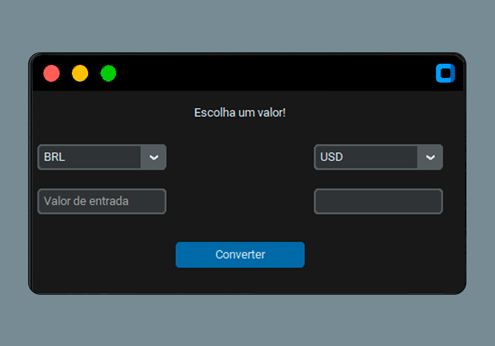

# 💱 Conversor de Moedas - v1.0

Um conversor de moedas com interface gráfica moderna usando `CustomTkinter` e a API gratuita [ExchangeRate.host](https://exchangerate.host/). Permite conversões em tempo real entre diferentes moedas com validações de entrada e interface intuitiva.

---

## 🚀 Funcionalidades

- ✅ Interface gráfica com `CustomTkinter`
- 🌎 Conversão entre diversas moedas internacionais
- 🔍 Validação automática dos campos (valor e moedas)
- 🧠 Verificação de disponibilidade da API antes de abrir a interface
- 💬 Exibição de mensagens de erro e sucesso

---

## 🛠️ Tecnologias e Bibliotecas

- Python 3.8+
- [CustomTkinter](https://github.com/TomSchimansky/CustomTkinter)
- `requests`
- `python-dotenv` para gerenciar a chave da API

---

## 📦 Instalação

### 1. Clone o repositório

`git clone https://github.com/ClovesJunior210/conversor-moedas-python-api`

Em seguida, entre na pasta do projeto:

`cd conversor-moedas`

### 2. Instale as dependências

Execute o comando para instalar as bibliotecas necessárias:

`pip install -r requirements.txt`

### 3. Crie um arquivo `.env`

Crie um arquivo `.env` na raiz do projeto com a seguinte linha:

`API_KEY=sua_chave_da_api`

> 🔑 A chave pode ser obtida gratuitamente em: [https://exchangerate.host](https://exchangerate.host)

### 4. Execute o programa

Para rodar o conversor de moedas, execute o seguinte comando:

`python main.py`

---

## 🖼️ Captura de Tela



---

## 📁 Estrutura do Projeto

```
├──assets
    └── img_exemple.png # Imagem exemplo
├── docs
    └── api_reference.txt     # Documentação da API usada
├── src
    └── main.py              # Código principal com lógica e interface
├── .env                 # Chave da API 
├── .gitignore           # Arquivos para o git ignorar 
├── README.md            # Este arquivo
├── requirements.txt     # Dependências do projeto
```
---
